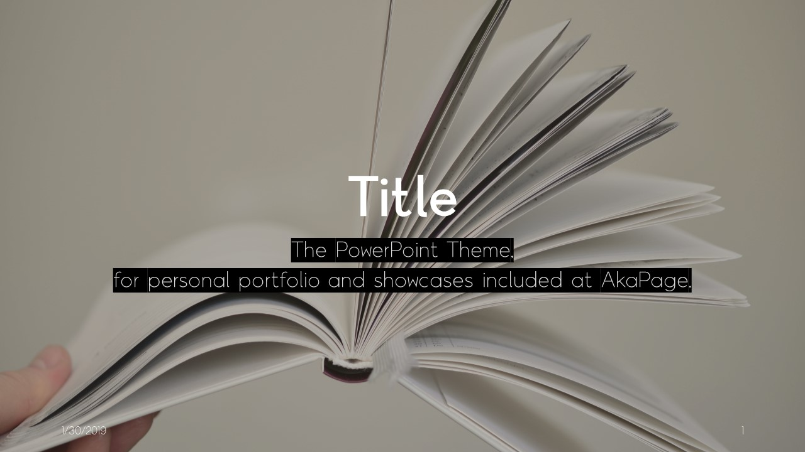

# AkaPage-Title-PowerPoint-Theme

The PowerPoint Theme, made for personal portfolio and showcases.

Copyright (c) 2019 [Seia-Soto](https://github.com/Seia-Soto) All Rights Reserved.
Distributed under [CC BY-SA 4.0](https://creativecommons.org/licenses/by-sa/4.0/) and [GPLv3](https://www.gnu.org/licenses/gpl-3.0.en.html).

## Table of Contents

- [Legal](#Legal)
- [Installation](#Installation)
- [Contribution](#Contribution)

### Legal

Copyright (c) 2019 [Seia-Soto](https://github.com/Seia-Soto) All Rights Reserved.
Contributions and any changes to this theme is allowed without changing any metadata of file or removed visible copyright holder's name.

Originally template doesn't have any visible copyright notice, so you need to add it yourself. Why I removed copyright notice from PowerPoint template is for your presentation. Just add copyright for any visible position of your complete presentation, because that will make better performance about your presentation.

This template was distributed under [Creative Commons BY-SA 4.0](https://creativecommons.org/licenses/by-sa/4.0/) and [GPLv3](https://www.gnu.org/licenses/gpl-3.0.en.html), so this repository applies CC BY-SA basically but also adapted GPLv3. About compatible and details visit [official creative commons blog](https://creativecommons.org/2015/10/08/cc-by-sa-4-0-now-one-way-compatible-with-gplv3/). So, this means GPLv3 is additionally adapted on CC BY-SA with one-way only, that contributing is only allowed with CC BY-SA materials under GPLv3.

Below is conflict between two license.

| Action | Allowed |
| :------------- | :------------- |
| Share-Alike in [Creative Commons BY-SA 4.0](https://creativecommons.org/licenses/by-sa/4.0/) | Allowed with [GPLv3](https://www.gnu.org/licenses/gpl-3.0.en.html) terms |

Share-Alike makes conflict when project distributed under two license, but I decided to make this project under CC BY-SA, so this project follows CC BY-SA license basically. However, this project actually adapted two license. After applying GPLv3, project got conflict about sharing and distributing including a lot of small differences, in this situation using Share-Alike with GPLv3 terms is allowed, but using CC BY-SA terms at Share-Alike is not allowed because this two license get compatible with one-way only.

**About package of font**

Between you need to follow terms of fonts too. According to [publisher](http://www.thefontgroup.co.kr/) of font, this font could downloaded from origin server only, and it is why I didn't upload the archive of font to this repository, and there is some rules about using this fonts.

1. Why this package distributed as free is for helping person and small companies which are having hardships about publishing commercial book because of big expenses.
2. Only using for publication about this font is allowed, not for websites and videos...
3. Both commercial and non-commercial usage about this font is acceptable without any approve progress.

Details and origin can be found at [here](http://www.kepa.or.kr/Board/View.aspx?ID_BL=4440&ID_BT=8001). Link at below will directly download without clicking any buttons(just linking to file), if you want to download through clicking buttons from official page, use link above.

### Installation

- You need to install below software yourself into your platform to use.

| Requirements | Suggested version |
| :------------- | :------------- |
| [Microsoft Office PowerPoint](https://office.com/) | 2013 or higher |
| [The정고딕 (7 fonts included)](http://www.kepa.or.kr/Board/Popup/popFileDownload.aspx?ID_BLF=3360), [checking license](#Legal) is required | Included 7 font |

1. Install fonts from ZIP archive(download is available above) and extract it to any directory, then install it.

2. [Download the latest template file](./Title.thmx)(this downloads only template, if you want to make sure downloading all assets or downloading older versions, go to [releases](https://github.com/Sewritten/AkaPage-Title-PowerPoint-Theme/releases) and download which you want) and open with [Microsoft Office PowerPoint](https://office.com), then Application will automatically make your first slide of presentation.
3. After complete your presentation, you need to add copyright notice in your new presentation. (Basically template doesn't have any notice.)

### Contribution

Before contributing to this repository or project, you should read [Legal](#Lega) section. If you already ready, you need to commit changes to forked repository with GPLv3 license, because across these two license is allowed with one-way only.

Make sure you are following both two license.
